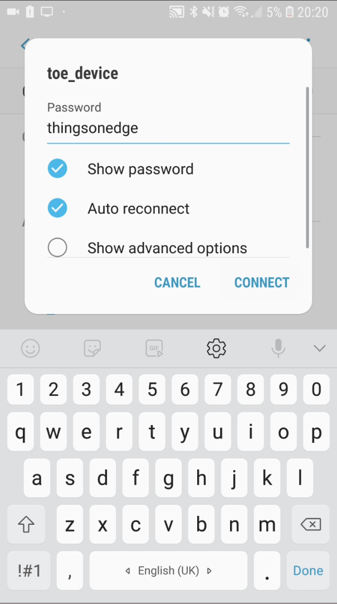
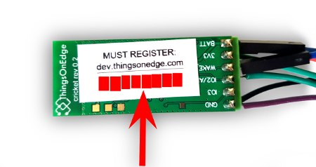

# Overview

Cricket is a ultra-low battery powered IoT Wi-Fi module for developers. It doesn't require IOT hubs, any coding nor programming to connect devices to the internet. It comes with a pre-installed software and integrated FREE Cloud service (Developer Portal / MQTT broker). Configure Cricket's connectivity out of the box either from a smartphone or a laptop from any web browser. 
Manage device(s) remotely and integrate them to other systems using either MQTT protocol or HTTP Post Events.

Main features:
* Can operate on a single AAA battery
* Ultra-low power, true 0A current when not in operation
* Built-in RTC used for wake_up
* Built-in temperature sensor
* Analog or Digital input for sensor
* Over-the-Air FW upgrade
* Cloud enabled HW configuration
* Battery monitor
* MQTT
* HTTP Post Events (i.e. used for IFTTT integration)

[thingsonedge.com](https://thingsonedge.com)

# Examples of what you can build
* <a href="https://www.thingsonedge.com/post/manage-your-blog-from-your-live-site" target="_blank"><b>IoT: Wi-Fi moisture sensor powered on a battery</b></a>

# HW description

## Pins definition

|Pin   | Description | 
|---|---|
|BATT| Power supply VDD to the board, this can be connected directly to the battery |
|3V3| Output power from internal regulator. This is always 3.3V regardless on BATT voltage level |
|WAKE_UP|HI level on that pin will turn board on|
|IO2|Ditigal or Analog input signal|
|IO3|Reserved|
|GND|Ground|
|||

# Module operations
The Cricket have 2 operation modes:

* Normal
* Binding 

In a normal operation mode the board is powered off and it needs aproximately 250nA for the RTC operation only.
The board is off until alarm is triggered from either an external WAKE_UP singal or an internal RTC.
When the board wakes up it performs FW initialisation and preapares for the normal operation - it usually takes around 600ms. Next, the board reads the configuration from its storage and evaluates all attached & enabled sensors. The configuration (sensors, parameters, ...) is set on the cloud service (dev.thingsonedge.com) by a developer. Every time the board connects to the internet it retrieves the latest configuration from the cloud.

Sensor evaluation process
Check if sensor is enabled
Read last sensor from the flash storage
Read current sensor value 
Compare sensor value

If any from enabled senosors are enabled and current value is diferent than last value recorder the board will start cloud update process which involves WiFi connectivity and cloud update using MQTT or HTTP post method.
If neither of enabled sensor have new evaluated value the board will turn off imidiatelly till next wake up signal provided.

This mechanism allows to be very power efficient when opetate on the battery.

# Ultra low-power scenarios

## Use cases 

1. Push button to send event notification to the cloud
When powered on 2xAAA alkaine batteries it can perform aprox 10K event notificaition delivery to the cloud regardless of the idle time. As long as battery likage is not big it can operate 5-10 years to porovide 10K putton press events.
When powered on 2AAA lithium batteries it can perform aprox 15K push buttons events.

2. Temperature sensor 
As above using 2xAAA alkaine batteries bosard can send aprox 10K notificsation to the cloud.

Assuming the board will use RTC to wake-up every 1hr to measure temperature it can operate mroe than 1 year.

lifetime = 10000 / (24*365) = 1.14 years = 1 year 2 months
This is very pessimistic calkulation when it assumed the remperature is changed at least 0.5℃ every hour.
Realisticly in most of the enviroments the temperature will change 4x less frequent, the board can then operate 4x longer.

lifetime = 10000 / (6*365) = 4.6 years = 4 year 7 months

# Configuration

# Connect to Wi-Fi network
Connect Cricket to the internet with Wi-Fi network in a few steps. All you need to do is to activate Cricket's private Wi-Fi hotspot and then open a private web page to pass your Wi-Fi network credentials.

Please follow the steps below:

<h4>Step 1.</h4>
Press and hold a button on Cricket for <b>5 seconds</b> until the LED is constantly lit.
It opens the "<b>toe_device</b>" WiFi hotspot. 

<h4>Step 2.</h4>
Once the LED is constantly lit Cricket opened the "<b>toe_device</b>" private Wi-Fi hot spot. Connect to this hot spot either from a laptop or smartphone with the following credentials: 
SSID: <b>toe_device</b> 
No password is required  

<h4>Step 3.</h4>
Once connected, open a private web page: <a href="http://192.168.4.1/index.html" target="_blank"><b>http://192.168.4.1/index.html</b></a>
 <b>NOTICE: make sure LED is still ON! If is OFF repeat the steps from the beginning (Step 1.)</b> 
Now you can pass your Wi-Fi network credentials and click CONNECT. If you passed correct SSID and Password then after few seconds the device should report it is online and the LED will be OFF.
 
Congratulations! Now your device is live and connected to the internet! 

# Connectivity
There are two ways of publishing data from the module to the online service.

MQTT - module comes with already integrated MQTT connectivity
HTTP - module can be configured to push HTTP Push request to desired location with customized payload

MQTT connectivity is always enabled and if there is any data to publish the module will perform MQTT publish to the specyfic topic.
Then, client can connect to ThingsOnEdge MQTT broker and subscribe for that topic to receive recent data update.

PICTURE

If a user wishes to use a custom MQTT broker it is possible to establish connection between 2 brokers in such way that client's broker subscribe specyfic topic from Things On Edge MQTT broker.

PICTURE

# MQTT
Cricket module sends MQTT messages via a central Things On Edge MQTT broker. Every module comes with a unique serial number which is used for user and password authentication credentials. Every data is sent on a separate MQTT topic.

Server address: **mqtt.thingsonedge.com**

Port: **1883**

All available topics for Cricket are listed below:

Topic teample:

**/{SN}/{prop}**

where:

**{SN}**    - Module unique serial number  
**{prop}**  - Module property/sensor type (see the table below for more information)

|{prop}   | Format | Unit | Example  | Description  | 
|---|---|---|---|---|
| temp | dd.d | C | 12.5  | Temperature from on-board sensor  |
| batt  | ddd  | decimals  | 124  | Current battery voltage level represented as 8bits decimal value  |
| io2  | ddd | decimals  | 100  | Current level on the IO2 port, if IO2 is configured as digital this is either 0 or 1  |
| io1_wake_up  | ddd | decimals  | 1  | The payload value of that topic is 1 if module was woken up by IO1 pin otherwise is 0. This message is only published if either IO1 wake-up is triggered or "Force updates on" is enabled in the module configuration.  |
| rtc_wake_up  | ddd | decimals  | 1  | The payload value of that topic is 1 if module was woken up by internal RTC otherwise is 0. This message is only published if either RTC wake-up is triggered or "Force updates on" is enabled in the module configuration.  |
| cnt_wake_up  | ddd | decimals  | 11  | This is internal counter represnets number of times module was woken up. |
| cnt_published  | ddd | decimals  | 12  | This is internal counter represnets number of times module published data to the service. |

d- single decimal digit

Examples:
To monitor temperature of device AABBCCDD use topic /AABBCCDD/temp
To monitor battery level of the device AABBCCDD use topic /AABBCCDD/batt

## Connecting to the ThingsOnEdge MQTT broker
MQTT broker server requires authentication by providing login and password which is unique for each module.
Module serial number shnould be use for both password and user when connecting from MQTT client.

# HTTP Push 

## Recomended operating conditions

|Operating Condition   | Symbol | Min | Typ | Max | Unit
|---|---|---|---|---|---
|Supply voltage| BATT | 1 | 3 | 3.5 | V
|Operating temperature|  | -40 | 20 | 125 | ℃
|Wake up voltage| Wake_up | 1 | 3 | 3.5 | V
||||||

## List of cricket properties

Battery voltag ecan be calculate using formula:
batt_vcc = batt * (3.5/256)

